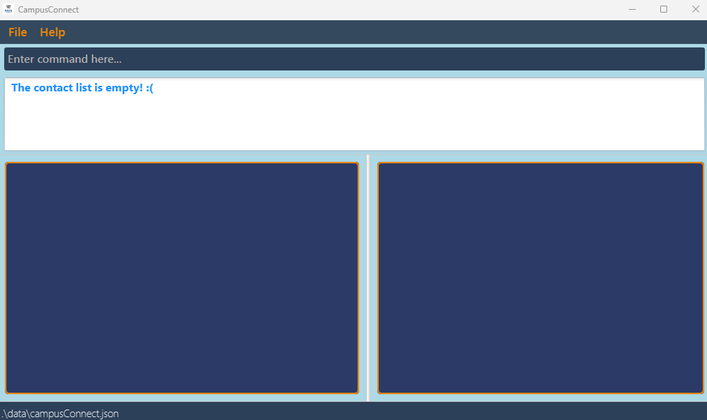
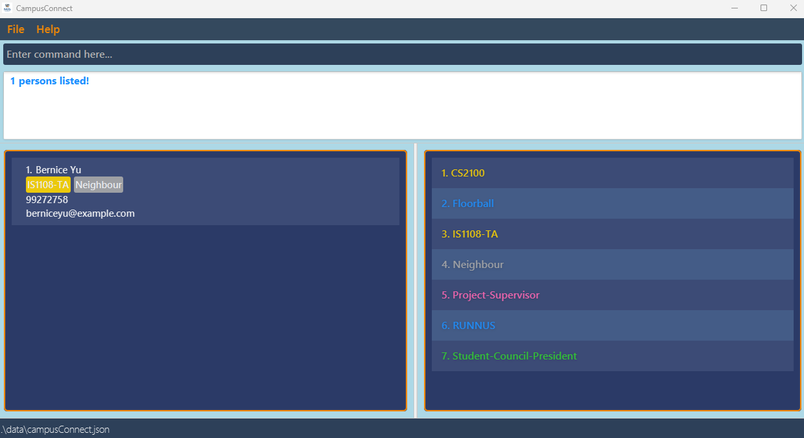
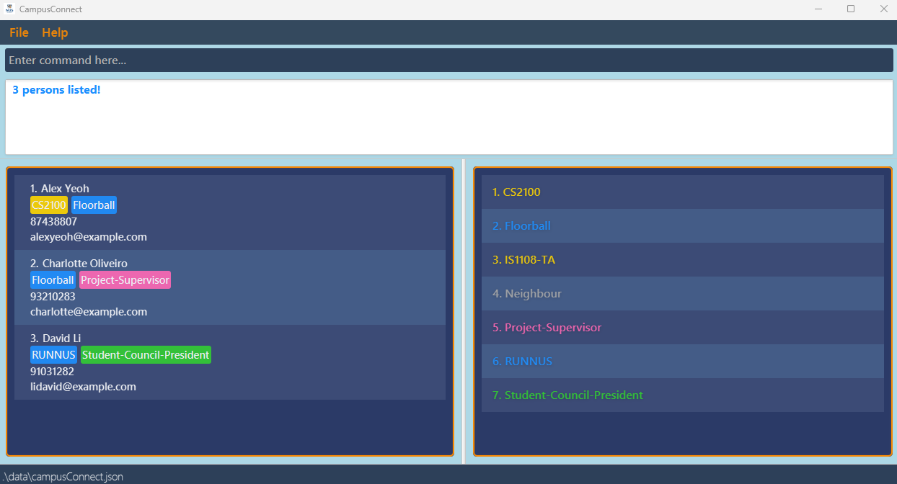

# CampusConnect User Guide

**CampusConnect** is the ultimate contact management app for NUS students with speedy typing skills. Our
contact tagging, finding, and organisation features ensure that with just a few keystrokes, you never forget
who you meet, where you met them, and what their contact details are.

**CampusConnect** offers a seamless and quick contact management experience using our *Command Line Interface* style of
input, where commands are processed in the blink of an eye. If you can type quickly, we can get it done faster than 
any traditional point-and-click management app.

<!-- * Table of Contents -->
<page-nav-print />

--------------------------------------------------------------------------------------------------------------------

## Quick start

1. Ensure you have Java `17` or above installed in your Computer.

1. Download the latest `.jar` file from [here](https://github.com/AY2425S1-CS2103T-F14a-4/tp/releases/).

1. Copy the file to the folder you want to use as the _home folder_ for your CampusConnect.

1. Open a command terminal, `cd` into the folder you put the jar file in, and use the `java -jar CampusConnect.jar` command to run the application. 
   A GUI similar to the below should appear in a few seconds. Note how the app does not contain any sample data. 
   

1. Type the command in the command box and press Enter to execute it. e.g. typing **`help`** and pressing Enter will open the help window. 
   Some example commands you can try:

   * `list` : Lists all contacts.

   * `add n/John Doe p/98765432 e/johnd@example.com` : Adds a contact named `John Doe` with phone number `98765432` and email `johnd@example.com` to CampusConnect.

   * `delete 1` : Deletes the 1st contact shown in the current list.

   * `clear` : Deletes all contacts.

   * `exit` : Exits the app.

1. Refer to the [Features](#features) below for details of each command.

--------------------------------------------------------------------------------------------------------------------

## Features

<box type="info" seamless>

**Notes about the command format:** 

* Words in `UPPER_CASE` are the parameters to be supplied by the user. 
  e.g. in `add n/NAME`, `NAME` is a parameter which can be used as `add n/John Doe`.

* Prefixes (for the contact information) refer to any of these: `n/`, `p/`, `e/`, `t/`, which are
  used for contact information (name, phone, email and tag respectively)

* Items in square brackets are optional. 
  e.g. `n/NAME [t/TAG]` can be used as `n/John Doe t/friend` or as `n/John Doe`.

* Items with `…`​ after them can be used multiple times including zero times. 
  e.g. `[t/TAG]…​` can be used as ` ` (i.e. 0 times), `t/friend`, `t/friend t/family` etc.

* Parameters can be in any order. 
  e.g. if the command specifies `n/NAME p/PHONE_NUMBER`, `p/PHONE_NUMBER n/NAME` is also acceptable.

* Extraneous parameters for commands that do not take in parameters (such as `help`, `list`, `exit` and `clear`) will be ignored. 
  e.g. if the command specifies `help 123`, it will be interpreted as `help`.

* If you are using a PDF version of this document, be careful when copying and pasting commands that span multiple lines as space characters surrounding line-breaks may be omitted when copied over to the application.
</box>

**Notes about duplicate contacts:** 
* A contact is considered a duplicate of another if it has the same Name, Phone or Email as the other contact.

**Notes about case sensitivity:** 
* Names, emails and tags are case-sensitive. 

**Notes about format of fields:** 
* Names should only contain alphanumeric characters and spaces
* Phone numbers should only contain numbers, start with 6, 8 or 9, and it must be 8 digits long
* Emails should be of the format `local-part@domain` and adhere to the following constraints:
1. The local-part should only contain alphanumeric characters and these special characters, excluding the parentheses, (+_.-)
2. This is followed by a '@' and then a domain name. The domain name is made up of domain labels separated by periods.
   The domain name must:
    - end with a domain label at least 2 characters long
    - have each domain label start and end with alphanumeric characters
    - have each domain label consist of alphanumeric characters, separated only by hyphens, if any.
* Tag names should be alphanumeric. Tags that have multiple words can be separated by a hyphen (-)
--------------------------------------------------------------------------------------------------------------------

## Command summary

|                                     Action                                      |                                                        Format, Examples                                                         |
|:-------------------------------------------------------------------------------:|:-------------------------------------------------------------------------------------------------------------------------------:|
|                         **[Add](#adding-a-person-add)**                         | `add n/NAME p/PHONE_NUMBER e/EMAIL [t/TAG]…​`   e.g., `add n/James Ho p/91231234 e/jamesho@example.com t/friend t/classmate` |
|                    **[Clear](#clearing-all-entries-clear)**                     |                                                             `clear`                                                             |
|                     **[Delete](#deleting-a-person-delete)**                     |                                               `delete INDEX`  e.g., `delete 3`                                               |
|                       **[Edit](#editing-a-person-edit)**                        |         `edit INDEX [n/NAME] [p/PHONE_NUMBER] [e/EMAIL] [t/TAG]…​`  e.g.,`edit 2 n/James Lee e/jameslee@example.com`         |
| **[Find by contact information](#finding-persons-by-contact-information-find)** |                       `find PREFIX/KEYWORD [PREFIX/MORE_KEYWORDS]…​`  e.g., `find n/James t/floorball`                       |
|             **[Add tag](#adding-tags-to-a-specific-person-addtag)**             |                       `addtag INDEX t/KEYWORD [t/MORE_TAGS]…​`   e.g. `addtag 1 t/friend t/classmate`                        |
|                **[Delete tag](#deleting-a-person-s-tag-deltag)**                |                                     `deltag INDEX t/KEYWORD`   e.g. `deltag 1 t/friend`                                      |
|                **[Categorize tag](#categorizing-a-tag-cattag)**                 |                    `cattag t/TAG [t/MORE_TAGS…​] CATEGORY`   e.g. `cattag t/floorball t/mahjong activity`                    |
|                     **[Undo action](#undo-a-command-undo)**                     |                                                             `undo`                                                              |
|                     **[Redo action](#redo-a-command-redo)**                     |                                                             `redo`                                                              |
|                      **[List](#listing-all-persons-list)**                      |                                                             `list`                                                              |
|                         **[Help](#viewing-help-help)**                          |                                                             `help`                                                              |

--------------------------------------------------------------------------------------------------------------------
## Commands

### Viewing help : `help`

Shows a message with a clickable hyperlink.

When clicked, this hyperlink will show the help page.

Format: `help`

### Adding a person : `add`

Adds a person to CampusConnect.

Format: `add n/NAME p/PHONE_NUMBER e/EMAIL [t/TAG]…​`

<box type="tip" seamless>

**Tip:** A person can have any number of tags (including 0)
</box>

* The phone number must follow the Singaporean convention: have 8 digits, start with 6, 8, or 9, and consist only of numbers.
* Duplicate contacts cannot be added to the list.
* Names are case-sensitive. For example, “Alice” and “alice” are considered distinct names.
* Names should only contain alphanumeric characters and spaces, and it should not be blank.

Examples:
* `add n/John Doe p/98765432 e/johnd@example.com`
* `add n/Betsy Crowe t/friend e/betsycrowe@example.com p/92345672 t/criminal`

### Listing all persons : `list`

Shows a list of all persons in CampusConnect.

Format: `list`

### Editing a person : `edit`

Edits an existing person in CampusConnect.

Format: `edit INDEX [n/NAME] [p/PHONE] [e/EMAIL] [t/TAG]…​`

* Edits the person at the specified `INDEX`. The index refers to the index number shown in the displayed person list. The index **must be a positive integer** 1, 2, 3, …​
* At least one of the optional fields must be provided.
* Existing values will be updated to the input values.
* When editing tags, the existing tags of the person will be removed, i.e. adding of tags is not cumulative.
* You can remove all the person’s tags by typing `t/` without
    specifying any tags after it.
* After editing the contact, it should not be a duplicate of another contact.

Examples:
*  `edit 1 p/91234567 e/johndoe@example.com` Edits the phone number and email address of the 1st person to be `91234567` and `johndoe@example.com` respectively.
*  `edit 2 n/Betsy Crower t/` Edits the name of the 2nd person to be `Betsy Crower` and clears all existing tags.

### Finding persons by contact information : `find`

Finds persons whose names, email address, contact number, or tag contain any of the given keywords.

Format: 

`find PREFIX/KEYWORD [PREFIX/MORE_KEYWORDS]…​`

* Only the specified fields are searched.
* The search is case-insensitive. e.g. `hans` will match `Hans`
* The order of the keywords does not matter. e.g. `Hans Bo` will match `Bo Hans`
* Persons matching at least one keyword will be returned (i.e. `OR` search).
  e.g. `Hans Bo` will return `Hans Gruber`, `Bo Yang`

How `find` works with multiple parameters:
* If multiple keywords for a field are present, `find` will display contacts that satisfy *any* keyword for that field.
* If multiple fields are present, `find` will display contacts that satisfy **all** of these fields.

Examples:
* `find n/bernice t/is1108` returns `Bernice Yu` 
  
* `find t/floor t/run` returns all contacts with any tag containing `floor` or `run`  
  

### Deleting a person : `delete`

Deletes the specified person from CampusConnect.

Format: `delete INDEX`

* Deletes the person at the specified `INDEX`.
* The index refers to the index number shown in the displayed person list.
* The index **must be a positive integer** 1, 2, 3, …​

Examples:
* `list` followed by `delete 2` deletes the 2nd person in CampusConnect.
* `find n/Betsy` followed by `delete 1` deletes the 1st person in the results of the `find` command.

### Adding tags to a specific person : `addtag`

Adds the specified person's tag.

Format: `addtag INDEX t/TAG [t/MORE_TAGS]…​`

* Adds the tags with the specified name `TAG` of the person at the specified `INDEX`.
* The index refers to the index number shown in the displayed person list.
* The index **must be a positive integer** 1, 2, 3, …​
* Multiple tags can be added at a time.
* Attempt to add duplicate tags to a person will cause an error message to be thrown.

Examples:
* `addtag 1 t/friend` adds a 'friend' tag to the first person in the list.
* `addtag 2 t/classmate t/neighbour` adds both the 'classmate' and 'neighbour' tag to the second person in the list.

### Deleting a person's tag : `deltag`

Deletes the specified person's tag.

Format: `deltag INDEX t/TAG`

* Deletes the tag with the specified name `TAG` of the person at the specified `INDEX`.
* The index refers to the index number shown in the displayed person list.
* The index **must be a positive integer** 1, 2, 3, …​
* Only one tag can be deleted at a time.
* The list of the tag will be updated accordingly.

Examples:
* `deltag 1 t/friend` 
deletes the friend tag of the first person in the list.

### Categorizing a tag : `cattag`

Categorizes a tag under a defined category.

Format: `cattag t/TAG [t/MORE_TAGS]…​ CATEGORY`

* Sets the tag(s) in CampusConnect with the specified name `TAG` to fall under the specified `CATEGORY`.
* Currently available categories with their respective keywords and colours are:

    Category      | Keyword (case sensitive) | Colour
    --------------|--------------------------|-  
    **General**   | `general`                |  Grey 
    **Academics** | `acads`                  |  Gold 
    **Activities**| `activity`               |  Blue 
    **Networking**| `network`                |  Green           
    **Mentorship**| `mentor`                 |  Pink 

* Multiple tags can be categorized to the same category at a time.
* All tags specified must be valid existing tags.
* Attempts to set a tag to its current category will cause the whole command to be rejected.
* Only one category is allowed to be entered per command, i.e. `cattag t/tag1 acads t/tag2 general` is not allowed.

Examples:
* `cattag t/CS2100 acads` categorizes the tag `CS2100` under `Academics` and display colour of the tag`CS2100` becomes `Gold`.
* `cattag t/floorball t/mahjong activity` categorizes both tags `floorball` and `mahjong` under `Activities` with colour `Blue`. 
* Newly created tags (by [`add`](#adding-a-person-add) or [`addtag`](#adds-tags-to-a-specific-person--addtag)) will have category `General` and colour `Grey` by default.

### Undo a command : `undo`

Undoes the previous command and reverts CampusConnect.

Format: `undo`

* Reverts the state of CampusConnect to the one before the most recent command, if any.
* When the oldest version of CampusConnect is reached, `undo` command will cause an exception to be thrown
* Only commands that modify the data of CampusConnect can be undone. Commands such as `list` and `find` will not be undone.

### Redo a command : `redo`

Reapplies a command that was previously undone by `undo`.

Format: `redo`

* Advances CampusConnect to the state it was in before the most recent `undo` command, if any.
* Only commands that modify the data of CampusConnect can be redone. Commands such as `list` and `find` will not be redone.
* Note: If a new command (excluding `redo` or `undo`) is executed after an `undo`, the redo history is cleared, and further `redo` will not be possible.

### Clearing all entries : `clear`

Clears all entries from CampusConnect.

Format: `clear`

### Exiting the program : `exit`

Exits the program.

Format: `exit`

### Saving the data

CampusConnect data is saved in the hard disk automatically after any command that changes the data. There is no need to save manually.

### Editing the data file

CampusConnect data is saved automatically as a JSON file `[JAR file location]/data/CampusConnect.json`. Advanced users are welcome to update data directly by editing that data file.

<box type="warning" seamless>
**Caution:**
If your changes to the data file makes its format invalid, CampusConnect will discard all data and start with an empty data file at the next run.  Hence, it is recommended to take a backup of the file before editing it. 
Furthermore, certain edits can cause CampusConnect to behave in unexpected ways (e.g., if a value entered is outside the acceptable range). Therefore, edit the data file only if you are confident that you can update it correctly.
</box>

--------------------------------------------------------------------------------------------------------------------
## FAQ

**Q**: How do I transfer my data to another Computer? 
**A**: Install the app in the other computer and overwrite the empty data file it creates with the file that contains the data of your previous CampusConnect home folder.

**Q**: How can I add contacts with the same name? 
**A**: If two contacts share the same name, you can differentiate them by adding a number or adjusting the capitalization. For example, use “Mary” and “Mary 2” or “John” and “john” to keep each entry unique.

**Q**: What if I need to use special characters in tags? 
**A**: You can work around this by using hyphens (-) to signify spacing and eliminate all special characters. For example, you can add "Cafe@NUS" as a tag using "Cafe-NUS".

**Q**: Why can't I find fields by whole words? There's too much clutter! 
**A**: We understand the importance of a neat and simple contact list. But, like search engines, we want to give you unparallelled control and flexibility over how you find contacts. As is often said, "It is better 
to give too much than to not give at all", and we believe that finding by whole words is not enough and gives too little.

**Q**: Why are tags case-sensitive? Now I can just add tags with different cases and clutter up CampusConnect... 
**A**: Again, we want to give you the flexibility to customise your own tags, so we allow this.

**Q**: Why does the tags list not update when I `find` something?  
**A**: Our tags list is meant to span the entire contact list, which can serve as a reference if you require to find a contact to add a specific and easily-forgettable tag to.
--------------------------------------------------------------------------------------------------------------------

## Known Issues

1. **When using multiple screens**, if you move the application to a secondary screen, and later switch to using only the primary screen, the GUI will open off-screen. The remedy is to delete the `preferences.json` file created by the application before running the application again.
2. **If you minimize the Help Window** and then run the `help` command (or use the `Help` menu, or the keyboard shortcut `F1`) again, the original Help Window will remain minimized, and no new Help Window will appear. The remedy is to manually restore the minimized Help Window.
3. **If the value of a field is too long**, the display will not render the full value properly. However, we expect that the average contact will not have such a long name nor require a long tag name.

